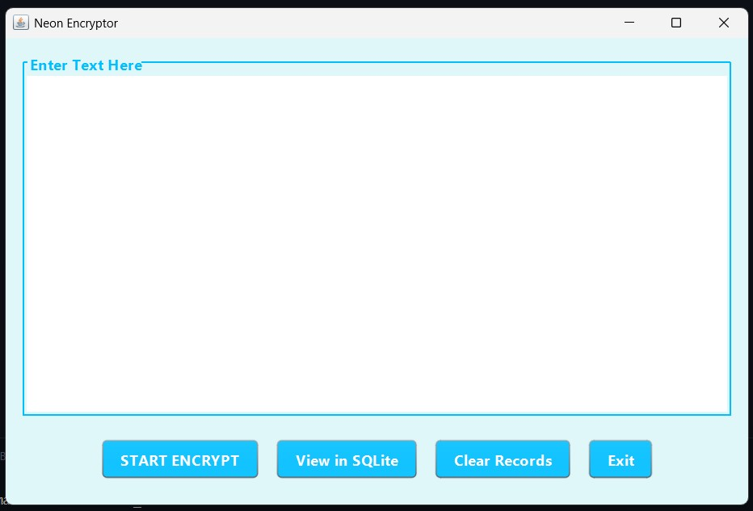
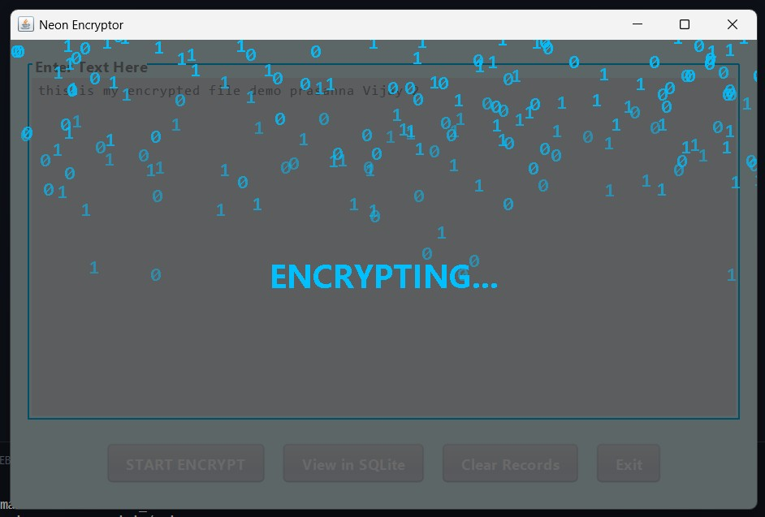
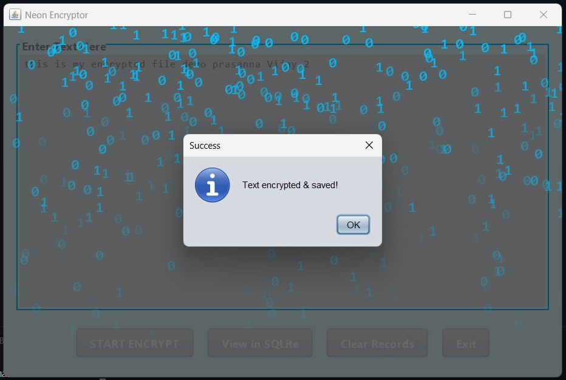
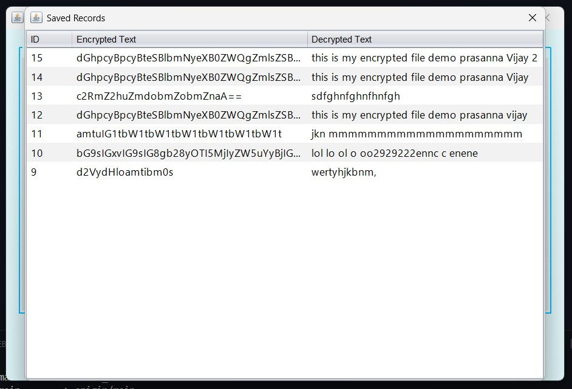
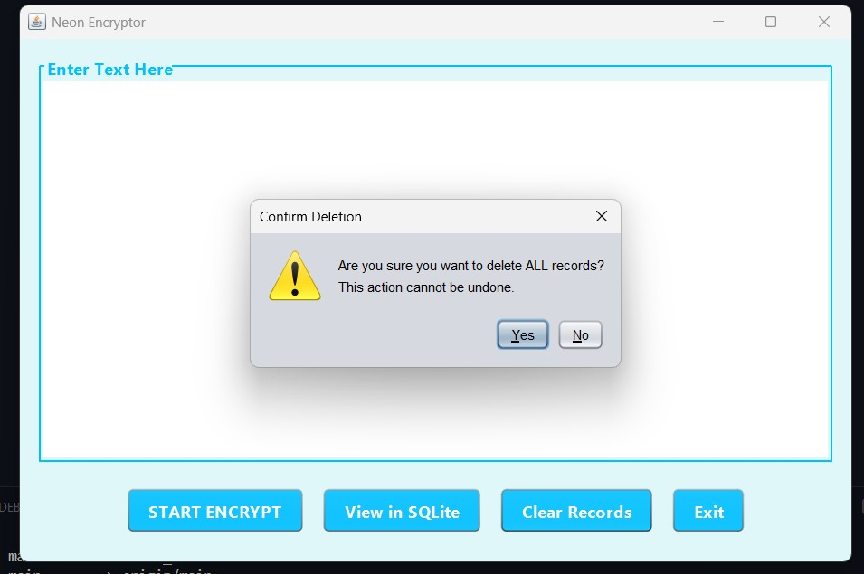
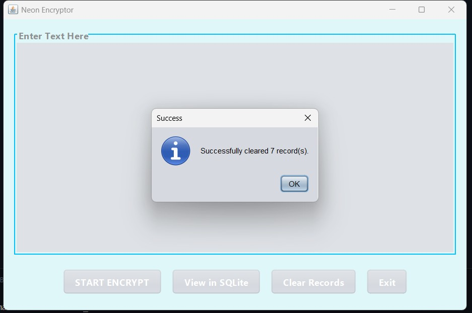
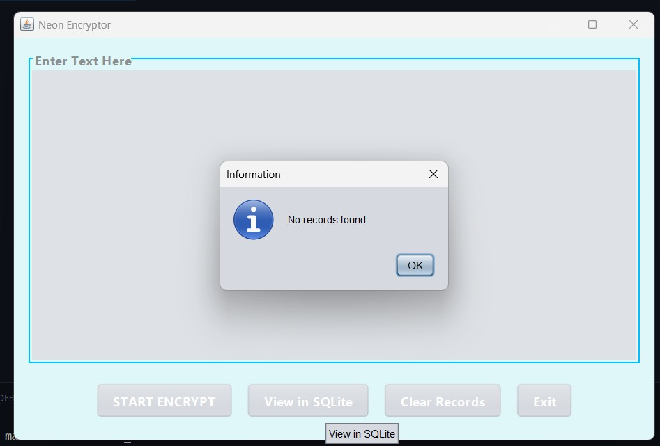
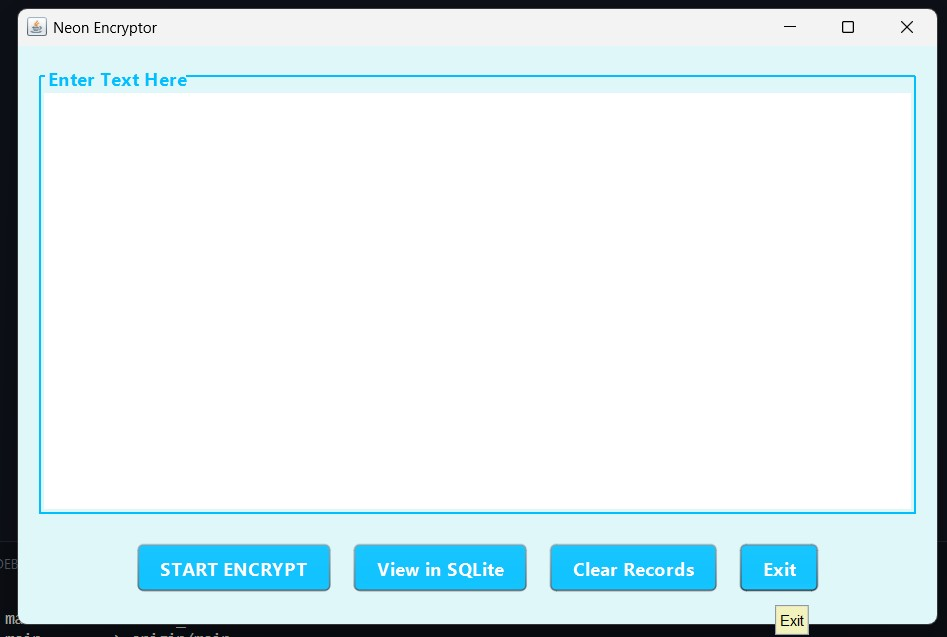
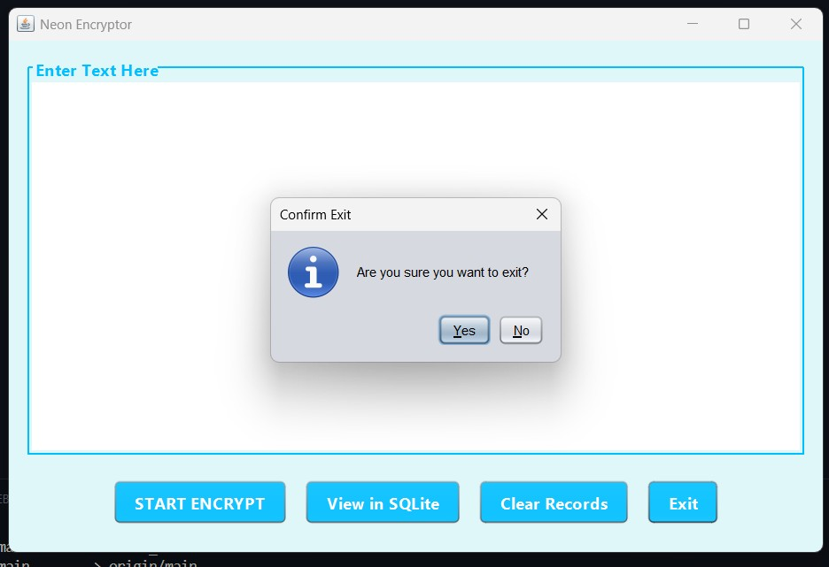

# Neon-Encryptor

Neon Encryptor is a .txt - text encryptor which works on Java Swing GUI and Base64 binary-to-text encoding scheme algorithm. This is a visual encoder, more than a real encryption algorithm like AES. 

**Working:**

The encoded text is encrypted and sent to a SQLite server instance.

And stored records are retrieved from the SQLite database and placed back into the view records area. 

Although not yet developed, a future feature could allow users to decrypt any text from the location of their choosing, and give them further visualization hints should they need to manage updates.

**Storage and management**

When users encrypt text, they have the option to save it in an SQLite database in the application’s local storage. 

Once stored, the text message could be viewed again later using a SQLite Viewer tool, or even inside the Neon Encryptor's user interface after pressing the View saved message button.

Any time a new message is stored, the Neon Encryptor will issue a confirmation notification dialog showing the uniquely assigned message ID for reference. The Neon Encryptor allows multiple saved messages in the local SQLite database, and will not append new entries after the 30th record.

Users also need the ability to Clear the Messages/Records made by the application. If a user wants to remove any saved messages from local storage, there is a button, located in the button panel, labelled Clear Records. Pressing the button will issue a warning confirmation dialog box, and will delete all records from local storage. 

**Exiting the Java Application**

Exit on command - exits the Java application.

**Conclusion**

The Neon Encryptor, as a standalone Java GUI application using SQLite locally, will deliver a fast and input friendly experience that is only limited by the Java platform.

Goal of the Neon Encryptor specifically was to create a, easy to navigate GUI for text management, but also looks aesthetically pleasing. 

I hope you have enjoyed the tour of my project - the Neon Encryptor. 

